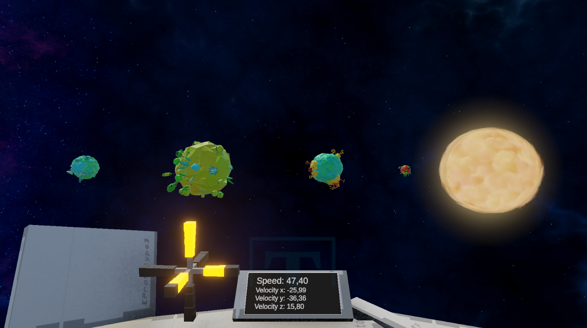

    

# Solar system simulation

## About the Project
This project was inspired by **Outer Wilds** — an attempt to recreate the experience of exploring a handcrafted solar system with realistic flight mechanics and orbital motion.

## Project Goals
The main objective is to **enhance development skills within the ECS**. The project focuses on blending OOP and ECS, keeping only the visual layer and, for now, the physics on the engine side, with **plans to eventually move physics into the ECS layer** as well, while all other gameplay logic is handled through systems and services. The project also aims to build experience with Unity networking frameworks and **integrate multiplayer features** using an data-driven design.

## Technologies Used
- Unity 6000.2.6f2
- Entitas
- Zenject
- UniTask

## Assets Used

- [Skybox Series Free](https://assetstore.unity.com/packages/2d/textures-materials/sky/skybox-series-free-103633)
- [Poly Planets](https://assetstore.unity.com/packages/3d/poly-planets-34894)
- [Planets of the Solar System 3D](https://assetstore.unity.com/packages/3d/environments/planets-of-the-solar-system-3d-90219)

## Project Architecture
The project is built on the **ECS** (Entity-Component-System) architecture::
- Spacship and celestial bodies are represented as entities
- Systems handle movement and rotation
- Player input is processed through the new Input System

A **global state machine** is registered in the *Project Context*, while all **local states** are registered in the *Scene Context*, ensuring proper isolation of gameplay services.

## Controls

| Action | Keyboard / Mouse | Gamepad |
|------------|--------|----------|
|XZ Axis Movement|WASD|Left stick|
|Y Axis Movement|Shift/Left Alt|Right/Left triggers|
|Rotation|Mouse|Right stick|

## Progress

| Feature | Status | Description |
|------------|--------|----------|
| Ship Movement | ✅ | Controls the ship relative to the camera |
| Ship Rotation | ✅ | Intuitive rotation using mouse or sticks |
| Gravity | ❌ | Planetary gravity affecting the ship and other bodies |
| Collisions | ❌ | Collision handling |
| Planetary Orbits | ❌ | Planet movement along orbits around stars |
| Ship HUD | ✅ | Displays velocity and other parameters |
| Multipleer | ❌ | Chosse Framework and Inplement logic |

## Installation & Run
1. Clone the repository
2. Open the project in Unity 6000.x
3. Open the **Boot** scene
4. Run the project in the Editor

## Future Plans
- Add atmospheric effects
- Develop a custom physics simulation system
- Implement ship damage mechanics
- Improve the ship’s HUD and UI